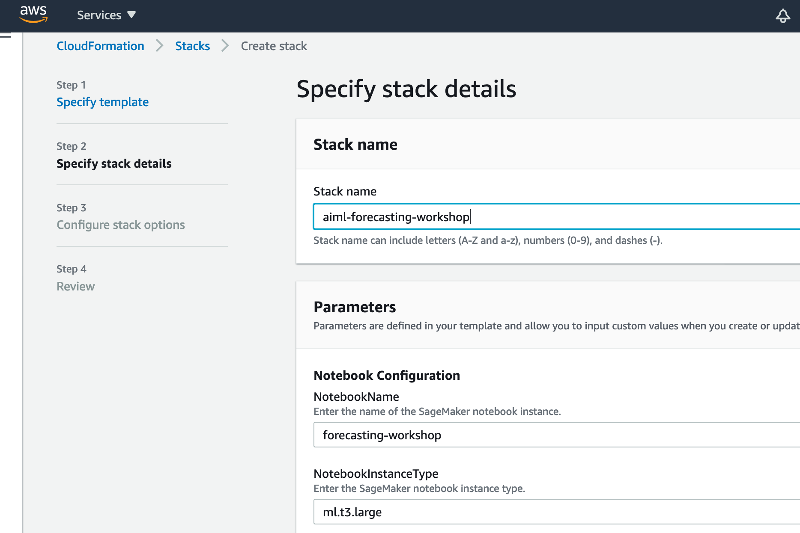
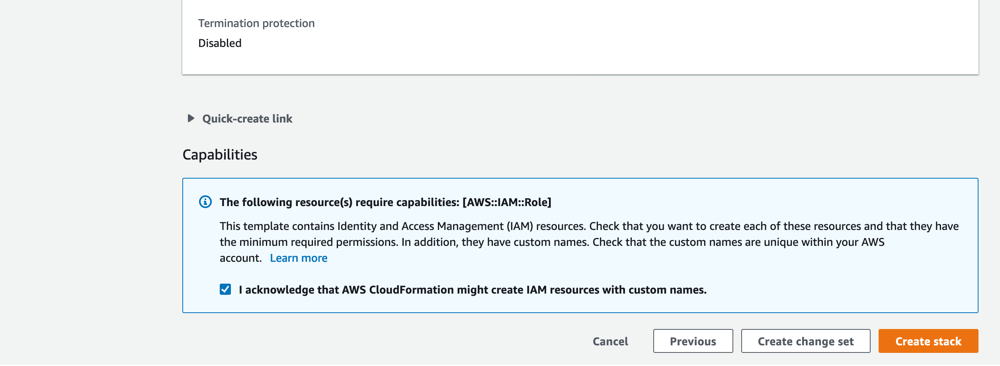
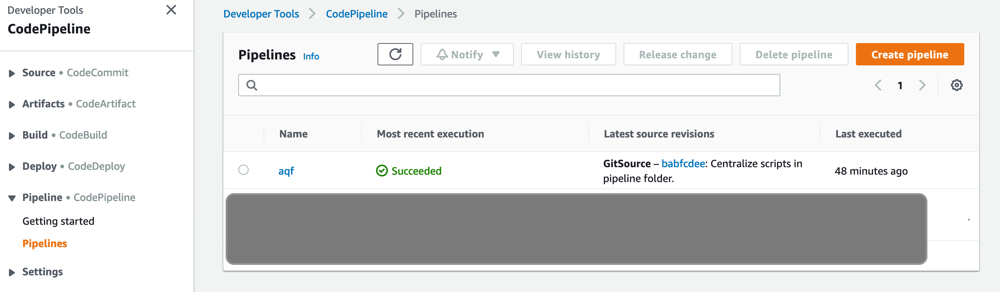
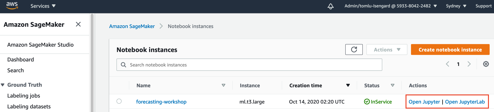
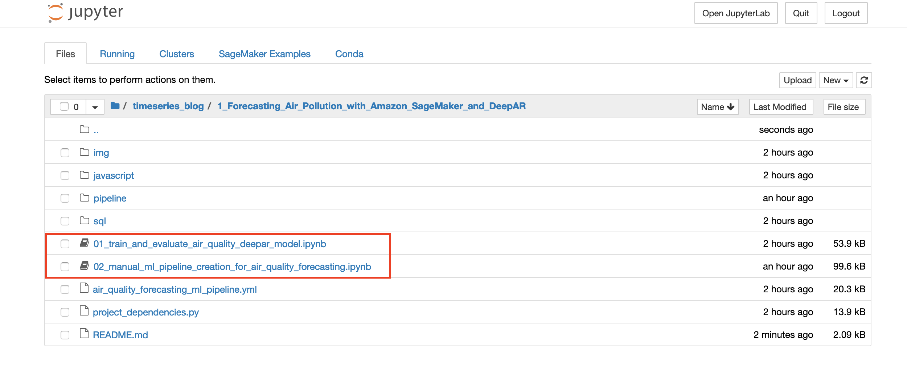

# Forecasting with time series data
In this collection of labs, we will explore how to solve various time-series forecasting problems. Time series analysis applies mathematical techniques to quantities that are ordered by time, in order to find insights about the past as well as the future. Historically, weather forecasting is one of the first time series analysis problem undertaken by humans. Predicting demand for future sales and services, forecasting utilization of compute resources and projecting call volume in call centres are all good examples of other common time series problems. With these four labs we will walk through solving different time series problems using a variety of techniques and AWS services. 

## What is time series analysis?
Time series analysis applies mathematical techniques to quantities that are ordered by time, in order to find insights about the past as well as the future. Historically, weather forecasting is one of the first time series analysis problem undertaken by humans. An early as Neolithic times, civilizations used calendars as a means to predict seasonal patterns for agriculture. Time series problems exist in almost every domain. Predicting demand for future sales and services, forecasting utilization of compute resources and projecting call volume in call centres are all good examples of time series problems.

Many of the methodologies used for time series analysis have been around for a long time. Long before deep learning techniques where even invented, algorithms like ARIMA have been in use since the 1950's. For many problems, these well-developed techniques are still the best way to solve time series problems. The recent exponential growth in data and compute power has spawned the development of machine learning techniques based on neural networks that work well with larger and more complex data sets. One example of this type of data is air quality measurements, which are composed of millions of measurements from hundreds of locations. The DeepAR algorithm developed by Amazon research scientists to do time series forecasting on large data sets of related time series, makes training a forecasting model with this complex data possible.

> **Definitions** Univariate means a single value type. Multivariate means multiple value types. For example, a time series of temperature and humidity is multivariate, whereas a time series of temperature alone is univariate. Many time series algorithms only work with univariate date. Some algorithms work with multivariate data, but only predicts values for a single target value type. The other time series is called the related time series or the "exogenous" time series. The DeepAR algorithm that we will use in this example works with multivariate data, but we will only use univariate air quality data. To improve the quality of the predictive model, we could also use an exogenous time series, such as wind or temperature, but this out of scope for this project.

## Time series labs
This time series workshop is broken into four independent labs that explore applying time series algorithms to a variety of different data sets to solve different use cases.  Each lab will introduce more topics and use cases, so pick the ones of interest to you. Each individual lab also has multiple parts, so you can pick what is more relevant to your role or upcoming project.  It's recommended you start with the first introductory lab on air quality prediction, and then explore other time-series labs to broaden your knowledge.

## Lab environment setup
To setup the lab environment, please create a AWS CloudFormation stack with [timeseries_workshop.yml](./timeseries_workshop.yml). Please note that the stack will spin up Amazon SageMaker notebook instance with proper access to run all labs. Especially, when creating the CFN stack, if you accepts all default parameter values, we will create a git repository under Amazon CodeCommit and map it as a code repository for the notebook instance; or, you may fork 'timeseries_blog' repo to your own and provide yours (such as GitHub username and token) so that the code repository created is mapped to your GitHub repository. Furthermore, the CFN stack will include a ML pipeline for Lab 1.

> Please note that once your SageMaker code repository is mapping to CodeCommit one, all your code changes in the SageMaker notebook instance can only be pushed to CodeCommit repository by default. If you want to interact with your GitHub repository, you may consider adding remote repository with 'git remote add XXX git-uri', etc.

### CloudFormation Stack Creation

> Assumed User is create the labs environment in AWS Sydney Region. If not, please correct the console link's query parameter `region`.

#### Steps 

1. If your workshop environment has been setup with AWS Event Engine, you can skip the CFN stack creation steps; otherwise, download github repo - [timeseries_blog](https://github.com/glyfnet/timeseries_blog.git) and launch AWS CloudFormation stack with referring to local [timeseries_workshop.yml](./timeseries_workshop.yml). Please accept the default parameter values which will refer to CodeCommit repo to integrate with CodePipeline for ML Pipeline creation and execution.

2. Once filling in stack name, click 'Next' button twice, then, scroll down to bottom of the page. Check ***I acknowledge that AWS CloudFormation might create IAM resources with custom names.*** and Click 'Click stack' button. The whole stack creation takes approx. 5-8mins.

3. Once CFN stack is created, you can explore pipeline setup in [AWS CodePipeline](https://console.aws.amazon.com/codesuite/codepipeline/pipelines?region=ap-southeast-2). Also, please note that CodePipeline will be automatically triggered once the stack  creation is done (as related CodeCommit project). 

4. Meanwhile, you can explore the notebooks with [Amazon SageMaker Notebook instances](https://console.aws.amazon.com/sagemaker/home?region=ap-southeast-2#/notebook-instances). Then, click 'Open Jupyter' or 'Open JupyterLab' to view the notebooks.

1. For example, once 'Open Jupyter', you can start playing with the notebook. Highly recommend that you should start with [Forecasting Air Quality with Amazon SageMaker and DeepAR](./1_Forecasting_Air_Pollution_with_Amazon_SageMaker_and_DeepAR/01_train_and_evaluate_air_quality_deepar_model.ipynb).

## Lab 1:
## Forecast air quality with Amazon SageMaker and DeepAR 

 

Poor air quality is one of the largest public health threats of our time with 8.8 million deaths each year with 90% occurring in developing countries. Predicting trends in air quality can help enable policy makers to make better day to day decisions and inform the public of possible dangers. Air quality measurements vary with location, season, day of the week, and time of day and also can depend upon other measurements like wind direction and temperature. The  complexity and volume of data involved makes forecasting future air quality values difficult. In addition, traditional techniques like ARIMA, require building separate forecast models for each individual location. Maintaining so many ML models adds further complexity to the production system. Deep neural networks are good at capturing patterns in large complex data sets, and a single model can be trained to work across multiple locations.

 
In this lab we will use the Open AQ (air quality) dataset on AWS Open Data Registry and Amazon SageMaker to build a predictive model for air quality. By using the SageMaker DeepAR algorithm, we will build a single machine learning model that will work across multiple cities in Australia. 

The Amazon SageMaker DeepAR forecasting algorithm is a supervised learning algorithm for forecasting scalar (one-dimensional) time series using recurrent neural networks (RNN). Classical forecasting methods, such as autoregressive integrated moving average (ARIMA) or exponential smoothing (ETS), fit a single model to each individual time series. They then use that model to extrapolate the time series into the future.

In many applications, however, you have many similar time series across a set of cross-sectional units. For example, you might have time series groupings for demand for different products, server loads, and requests for webpages. For this type of application, you can benefit from training a single model jointly over all of the time series. DeepAR takes this approach. When your dataset contains hundreds of related time series, DeepAR outperforms the standard ARIMA and ETS methods. You can also use the trained model to generate forecasts for new time series that are similar to the ones it has been trained on.

### Get started
The lab is split into two parts that can be run independently.

#### Train and evaluate the air quality DeepAR model
The first lab covers the data science process for creating and evaluating a model:
- Defining timeseries problems
- Querying raw data with Athena
- Timeseries feature engineering
- Model training, tuning and evaluation with SageMaker

[start the lab](1_Forecasting_Air_Pollution_with_Amazon_SageMaker_and_DeepAR/01_train_and_evaluate_air_quality_deepar_model.ipynb)

#### Machine learning pipeline creation for air quality 
The second lab covers creating the ML production system:
- Architecture design
- Feature engineering with SageMaker pipelines
- SageMaker Batch transforms
- Step functions integration with SageMaker

[start the lab](1_Forecasting_Air_Pollution_with_Amazon_SageMaker_and_DeepAR/02_manual_ml_pipeline_creation_for_air_quality_forecasting.ipynb)

## Lab 2
## Predict electricity demand with GluonTS

 
A common problem in many organisations is the need to accurately predict resource demand in order to pro-actively up scale and down scale supply to minimize costs while maintaining adequate service. Within AWS, this capability is essential to the cost-efficient
provisioning of resources like compute and storage. This is also important within utility providers for gas, electricity, water or broadband. With a predictive model that works for individual consumers, resource providers can execute pre-emptive actions that will avoid under or over supply. There are several algorithms that can be used to solve time series problems. Different algorithms may be better for certain problems or even the same problem during different time periods.  

In this lab we will build a variety of machine learning models to predict individual consumer electricity demand. Using the GluonTS library, we will train several time series models with different algorithms, visualize them and  compare them to see which works best with our data set. We will also show how to deploy a GluonTS model with SageMaker, and also how to deploy multiple GluonTS models within a single endpoint. 

### Get started
The lab is split into two parts that should be run in order.

#### Predict electricity demand with GluonTS
The first lab covers creating and evaluating multiple GluonTS models:

- Mean: Uses the mean in the training data to predict the next 24 hours.
- Seasonal Naive: Uses the last 24-hour observations to predict the next 24 hours.
- Exponential smoothing (ETS): Uses the weighted combinations of past observations to predict the next 24 hours.
- Prophet: Forecasting time series data based on an additive model where non-linear trends are fit with yearly, weekly, and daily seasonality, plus holiday effects.
- DeepAR: Probabilistic forecasting with autoregressive recurrent networks.

[start the lab](2_Predict_electricity_demand_with_the_GluonTS_and_SageMaker_custom_containers/01_predict_electricity_demand_with_the_gluonts_library.ipynb)

#### Deploy GluonTS as multi-model endpoints
The second lab explores how to host multiple GluonTS models at the same time using a single endpoint:
- Multi Model Server framework
- SageMaker Inference Toolkit
- SageMaker bring your own container

[start the lab](2_Predict_electricity_demand_with_the_GluonTS_and_SageMaker_custom_containers/02_deploy_gluonts_forecast_models_as_multi_model_endpoints.ipynb)

## Lab 3
## Automate sales projections with Amazon Forecast
 

 
In the retail industry, forecasting sales and visitor numbers is an important topic that directly affects your business. Accurate sales forecasting can help you avoid overstocked merchandise and lost sales opportunities. This helps to both reduce costs and increases revenue. Accurately predicting the number of visitors will also enable you to efficiently plan employee shifts and provide better customer service.

In this lab, we will walk through how Amazon Forecast, an AWS AI service for time-series forecasting, can be used to make predictions with a minimal amount of machine learning experience. We'll also show how Amazon Forecast can be easily integrated within a data pipeline so that updated forecasts can be automatically generated and exported whenever a new batch of data is uploaded to Amazon S3. We will also show how to use generated predictions within QuickSite and create viewable reports.

### Get started
The lab is split into two parts that should be run in order.

#### Data preparation for Amazon Forecast
The first lab covers preparing the data for Amazon Forecast

- Problem definition
- Architecture design
- Data analysis (missing data etc.)
- Data preparation for Amazon Forecast

[start the lab](3_Automate_sales_projections_with_Amazon_Forecast/1_prepare_dataset.ipynb.ipynb)

#### Sales forecasting with Amazon Forecast and Amazon QuickSite
The second lab integrate Amazon Forecast and Amazon QuickSite to create an end to end sales forecasting system:
- Train, evaluate and deploy models with Amazon Forecast
- Creating a report with Amazon QuickSite
- Build a production pipeline with step functions and lambda

[start the lab](3_Automate_sales_projections_with_Amazon_Forecast/2_build_forecast_pipeline.ipynb)

## Lab 4
## Anomaly detection from click-stream data using SageMaker RCF and DeepAR

Anomaly detection algorithms are used to find changes in data patterns. They have a wide range of applications, from detecting sudden changes in business metrics, detecting failure in complex systems, predictive maintenance, and even for monitoring data pipelines for unexpected changes. Some other types of events that can be detected include:
- Changes in the number of visitors or clickstreams on e-commerce websites
- Changes in the number of items sold or the amount of sales in retail business
- Changes in usage of disk, memory or CPU in applications and systems infrastructure
- Changes in values such as temperature, vibration, current, or torque from production machines and equipment

In many cases, humans can easily find irregularities if the data is visualized through a graph. But for practical reasons, it is impossible for humans to visually check hundreds of thousands of data points generated simultaneously in real time. Also, many anomaly detection systems use static threshold limits. Due to frequent changes from seasonality, trending, or daily and hourly cycles, these simple detection systems miss many events, or falsely predict to many events. Machine learning algorithms work well for these types of problems as they work with more complex data patterns, reducing the false positive and increasing the true positive rates.

In this lab, we will build an anomaly detection system for click stream data from a website. This system could be used to detect production problems within a website, or even detect changes in user behaviour that may need to be addressed. We will use two built-in algorithms provided by Amazon SageMaker, Random Cut Forest (RCF) and DeepAR. Amazon SageMaker Random Cut Forest (RCF) is an unsupervised algorithm for detecting anomalous data points within a data set. The Amazon SageMaker DeepAR forecasting algorithm is a supervised learning algorithm for forecasting scalar (one-dimensional) time series using recurrent neural networks (RNN). By comparing the predicted versus the actuals, we can use DeepAR for anomaly detection as well. Amazon Kinesis Data Analytics also provides an RCF function, and we will explore using this native anomaly detection function on a real-time stream of data.

### Get started
The lab is split into four parts. After completing the first lab on data analysis, you can try the other labs in any order.

#### Exploratory data analysis
The first part of the lab will focus on exploring and preparing the data needed for the other lab sections.

[start the lab](4_Anomaly_detection_with_RCF_and_DeepAR/1.Exploratory_Data_Analysis.ipynb)

#### Anomaly detection with RCF
The second part of the lab will explore using the RCF algorithm for anomaly detection.

[start the lab](4_Anomaly_detection_with_RCF_and_DeepAR/2.Amazon_SageMaker_RCF.ipynb)

#### Anomaly detection with DeepAR
The third part of the lab will explore using the DeepAR algorithm for anomaly detection.

[start the lab](4_Anomaly_detection_with_RCF_and_DeepAR/3.Amazon_SageMaker_DeepAR.ipynb)

#### Anomaly detection with Kinesis Data Analytics
The fourth part of the lab will explore using the Kinesis Data Analytics for anomaly detection.

[start the lab](4_Anomaly_detection_with_RCF_and_DeepAR/4.Amazon_Kinesis_Data_Analytics_RCF.ipynb)
